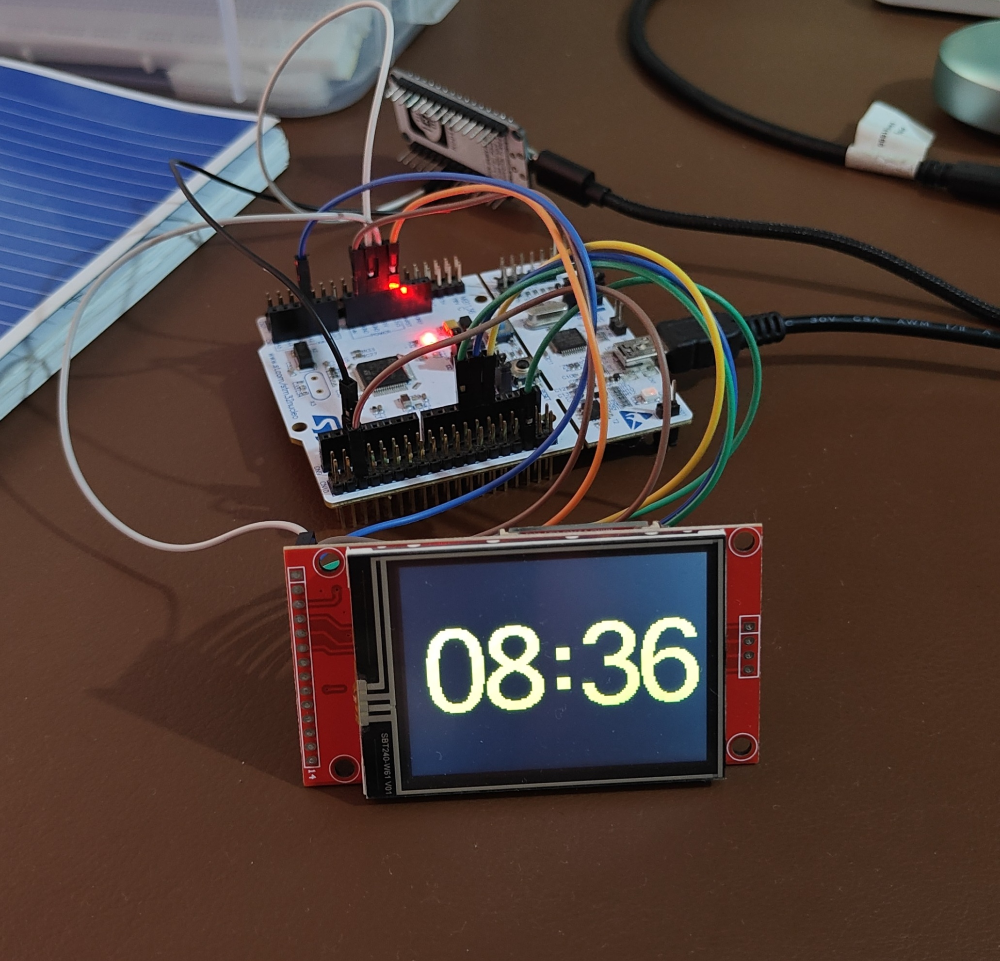
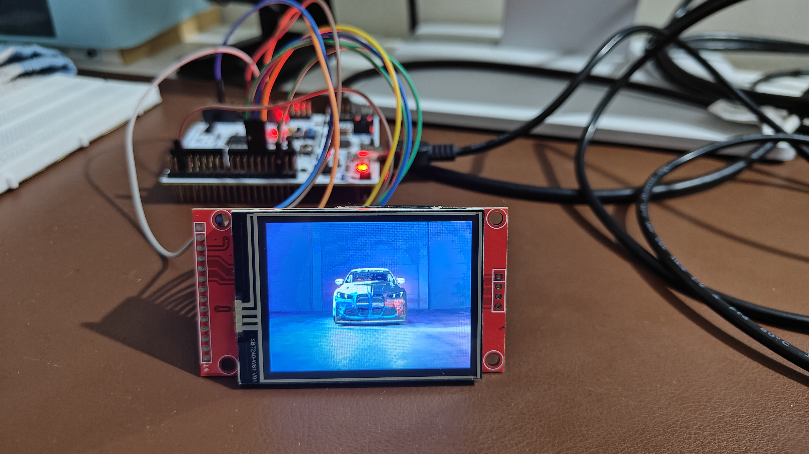

# STM32 TFT Display Project

This project drives an ILI9341-based TFT LCD from an STM32F446RE Nucleo board using STM32 HAL and SPI1. It includes app modes for a NodeMCU-fed time display, an ESP8266 weather display, display drawing demos, and bring-up tests for validating the LCD wiring.

## Hardware Used

- MCU board: STM32F446RE Nucleo
- Wi-Fi/UART board: NodeMCU ESP8266
- Display: ILI9341 TFT LCD, 240 x 320 pixels
- Interface: 4-wire SPI-style display control
- Toolchain: STM32CubeIDE
- HAL family: STM32F4xx HAL

## Project Structure

```text
Core/
  Inc/
    app.h                   Application lifecycle declarations
    app_config.h            Normal/test mode selection
    arduino code            NodeMCU ESP8266 sketch for fetching/sending data
    display_bringup.h       Display bring-up test declarations
    main.h                  GPIO labels and project-wide declarations
    stopwatch_display.h     UART time display declarations
    uart1_line_receiver.h   Interrupt-driven USART1 line receiver declarations
    weather_display.h       ESP8266 weather display declarations
  Src/
    app.c                   Project initialization and main loop hook
    display_bringup.c       Optional LCD wiring/display test modes
    main.c                  STM32Cube-generated entry point and hardware init
    stm32f4xx_hal_msp.c     SPI1, USART1, and USART2 pin alternate-function setup
    stopwatch_display.c     Large TFT time display from NodeMCU UART data
    uart1_line_receiver.c   Newline-terminated USART1 receive helper
    weather_display.c       UART weather receiver and TFT weather screen

LCD/
  Display/
    display.c               Higher-level display screens and image drawing
    display.h               Display function declarations
  ILI9341/
    ILI9341_Driver.c        Low-level ILI9341 driver
    ILI9341_Driver.h        Low-level drawing API
  Icons/
    *_icon*.h               RGB565 icon arrays
  Images/
    bmw.h                   Portrait BMW image data
    bmw_320x240.h           Landscape BMW image data
    spiderman.h             Spider-Man image data
    captain.h, ironman.h    Other image assets
```

## Board Connections

```text
TFT VCC    -> Nucleo 3V3
TFT GND    -> Nucleo GND
TFT SCK    -> PA5  / D13
TFT MOSI   -> PA7  / D11
TFT MISO   -> PA6  / D12  optional
TFT CS     -> PA4
TFT DC     -> PC4
TFT RESET  -> PC5
TFT LED/BL -> 3V3 or suitable backlight supply
```

## Project Photos

Time fetched by the NodeMCU and sent over UART, then displayed on the TFT:



TFT image/display bring-up output:



## ESP8266 / NodeMCU UART

The NodeMCU ESP8266 communicates with the STM32 over `USART1`. Normal project mode displays a large `HH:MM` time string received from the NodeMCU. Weather mode displays weather data fetched by the ESP8266 and sent to the STM32.

Wire the ESP8266 UART to STM32 `USART1`:

```text
NodeMCU ESP8266        STM32F446RE Nucleo
-----------------------------------------
D5 / GPIO14   ------>  PA10 / USART1_RX
D6 / GPIO12   <------  PA9  / USART1_TX
GND           ------>  GND
```

The serial settings are:

```text
115200 baud, 8 data bits, no parity, 1 stop bit
```

For `APP_MODE_PROJECT`, the STM32 expects one newline-terminated time string:

```text
HH:MM
```

Example:

```text
08:36
```

For `APP_MODE_WEATHER`, the STM32 expects one newline-terminated CSV line:

```text
time,temperature,humidity,windSpeed,weatherCode
```

Example:

```text
2026-07-05T13:00,37.1,35,19.0,3
```

The shared UART receiver lives in `Core/Src/uart1_line_receiver.c`. The time display lives in `Core/Src/stopwatch_display.c`, and the weather screen lives in `Core/Src/weather_display.c`.

## Display Driver Overview

The low-level ILI9341 driver lives in `LCD/ILI9341/ILI9341_Driver.c`.

Useful functions include:

```c
ILI9341_Init();
ILI9341_Set_Rotation(rotation);
ILI9341_Fill_Screen(color);
ILI9341_Draw_Pixel(x, y, color);
ILI9341_Draw_String(x, y, color, background, text, size);
ILI9341_Draw_Empty_Rectangle(color, x1, y1, x2, y2);
ILI9341_Draw_Circle(x0, y0, radius, color, fill);
```

The higher-level display screens live in `LCD/Display/display.c`:

```c
Display_Menu();
Display_Text();
Display_Picture();
Display_Color_Picture();
Display_BMW_Picture();
Display_Back_Icon(x, y);
```

## Display Rotation

The ILI9341 driver supports four rotations:

| Rotation | Screen Size Used by Driver | Typical Orientation |
|---:|---|---|
| `0` | 240 x 320 | Portrait |
| `1` | 320 x 240 | Landscape |
| `2` | 240 x 320 | Portrait flipped |
| `3` | 320 x 240 | Landscape flipped |

For the landscape BMW image, `Display_BMW_Picture()` uses rotation `3` and draws a 320 x 240 image:

```c
ILI9341_Set_Rotation(3);
```

The `bmw_320x240.h` image stores each RGB565 pixel as two array entries, so `Display_BMW_Picture()` combines the high and low bytes before drawing:

```c
uint32_t index = 2 * ((320 * y) + x);
uint16_t pixels = (bmw_landscape[index] << 8) | bmw_landscape[index + 1];
ILI9341_Draw_Pixel(x, y, pixels);
```

## Bring-Up Test Modes

`Core/Src/main.c` contains a compile-time switch:

```c
/* #define APP_MODE APP_MODE_DISPLAY_EXPERIMENT */
#ifndef APP_MODE
#define APP_MODE APP_MODE_PROJECT
#endif
```

Available modes:

| Value | Mode |
|---|---|
| `APP_MODE_PROJECT` | Normal project mode: displays `HH:MM` time from the NodeMCU on the TFT |
| `APP_MODE_RESET_HEARTBEAT_TEST` | Visible heartbeat/reset test |
| `APP_MODE_DISPLAY_EXPERIMENT` | Minimal LCD test area for display experiments |
| `APP_MODE_BITBANG_SPI_COLOR_TEST` | Bit-banged SPI LCD color cycle |
| `APP_MODE_HARDWARE_SPI_COLOR_TEST` | Hardware SPI LCD color cycle |
| `APP_MODE_WEATHER` | Weather display mode: parses ESP8266 weather CSV and draws time, date, temperature, humidity, wind, and weather summary |

The test implementation lives in `Core/Src/display_bringup.c`, keeping most test code out of `Core/Src/main.c`. `APP_MODE_DISPLAY_EXPERIMENT` is the easiest place to temporarily try display functions:

```c
Display_BMW_Picture();
Display_Text();
Display_Menu();
Display_Back_Icon(200, 200);
```

For normal project work, leave `APP_MODE` undefined or set it to `APP_MODE_PROJECT`. To run the weather screen instead, set `APP_MODE` to `APP_MODE_WEATHER`.

## Image and Icon Data

The project stores images and icons as C arrays:

- Full-screen images are in `LCD/Images/`
- UI icons are in `LCD/Icons/`
- Icons are included through `icons_included.h`

Avoid including icon headers such as `back_icon.h` directly in multiple `.c` files because those headers define the actual arrays. Including the same definition in more than one compilation unit causes linker errors such as:

```text
multiple definition of `back_icon_40x40'
```

Instead, keep icon drawing inside `display.c` or expose wrapper functions such as:

```c
Display_Back_Icon(0, 200);
```

## Current Status

The project can initialize the ILI9341 display, receive newline-terminated UART data from a NodeMCU ESP8266, display a large `HH:MM` time screen, display fetched weather data, draw primitive shapes and text, render menu icons, and draw full-screen RGB565 images in portrait or landscape orientation.
